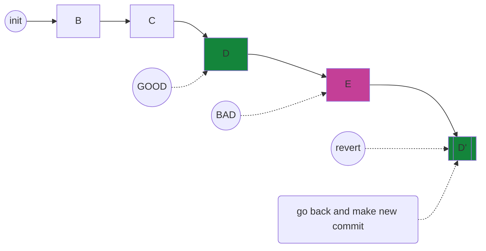

---
---

# Git Undo Commit

At some time, we may want to **go-back** early version of commits, or **undo** just-now commitment.

## git reset

official link: [`git-reset`](https://git-scm.com/docs/git-reset)

> Reset current HEAD to the specified state

`--mixed` is the default option, meaning set both `Index` and `HEAD` to target


## git revert

official link: [`git-revert`](https://git-scm.com/docs/git-revert)

> Given one or more existing commits, revert the changes that the related patches introduce, and record some new commits that record them. **This requires your working tree to be clean** (no modifications from the HEAD commit).




## git restore

official link: [`git-restore`](https://git-scm.com/docs/git-restore)

> Restore specified paths in the working tree with some contents from a restore source. If a path is tracked but does not exist in the restore source, it will be removed to match the source.
>
> The command can also be used to restore the content in the index with `--staged`, or restore both the working tree and the index with `--staged` `--worktree`.
>
> By default, if `--staged` is given, the contents are restored from `HEAD`, otherwise from the `index`. Use `--source` to restore from a different commit.

`-W == --worktree` from index

`-S == --staged` from HEAD


## git push

it happens when you want to **Undo** a remote commit, `git push` is the choose.

official document: [`git-push`](https://git-scm.com/docs/git-push)


pushing current branch to `remote/branch`

```
git push <remote> <branch>
```


safe one, only force push to remote which is in the same with your repo refs

```
git push <remote> <branch> --force-with-lease
```

## Undo last commit


```
git add file_in_changes
git commit --amend --no-edit
```


```note
for more, please refer [`git-commit`](git-commit.html)
```

