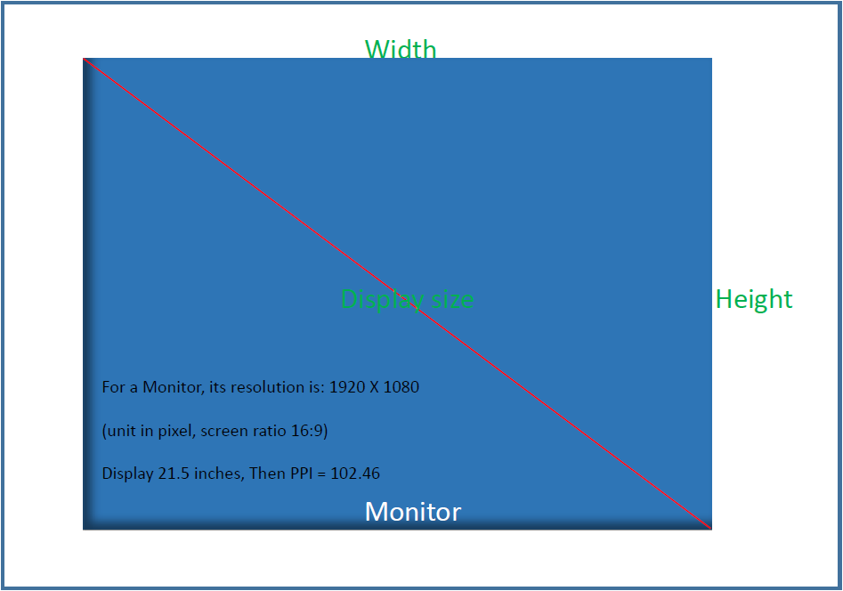

---
---

# Font Size

A very good document [`html-font-size`](https://smad.jmu.edu/shen/webtype/measure.html)


```note
in case of any errors, here is a backup file: [`backup-font-size`](file/html-font-size-2020-09-27.html)

All rights belong to the author that link shows.

Also, in here I express my great gratitude to OP for such a helpful and useful document!
```

**excerpt**:

> points (pt)
> 
> picas (pc)
> 
> inches (in)
> 
> centimeters (cm)
> 
> millimeters (mm)
> 
> ems (em)
> 
> percentages (%)


> 1 pt = 1/72 of an inch
> 
> 1 pc = 12 pts
> 
> 1 em = 16 px


**more** 

If the resolution for a monitor is 72 ppi (pixels per inch), then one point will equal with one pixel.

for the conversion,




