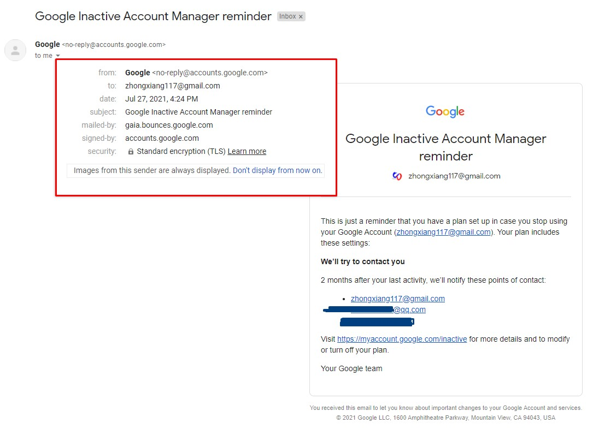
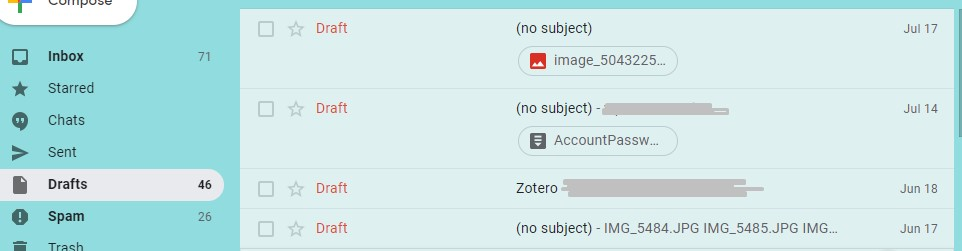

---
---

# Complaining on reminder about google long-time account inactive

first of all, I am a big fan of Google company, in my heart, I think Google is the toppest tech company, it is like the "God" among all those planet tech companies in my mind. Honestly, on of my dreams is that I can join in Google in some day. While due to some unsaying reasons, I may not make it come true anymore..

Back to today's topic, I happened to receive a notice email from Google, which is the reminder about long time inactive account, please see below,

I regard my google account very important and cherish it a lot, it is my truly PRIMARY email account from long long time ago. Wanna a proof? I can show you,

as you can see, google email contains all my personal information, and I have used it backup all my other accounts & passwords, even my bank documents. If you can hijack my google account, congrats, you "were" me.

In order to protect it, I have set up every measurements that I can do, as well as this inactive reminder though I literally use it in every minute, to avoid any type of unexpected situations.

I even used it on my driving when the time I received this inactive notice email. How the fuck my account is inactive in 2 month long??

How??? Can anyone please explain it?

it is like the heart broken when you suddenly found the people you valued so much that they actually take all those things for granted.

they even don't know who you are, and think your trust as a piece of shit.

fuck! I hope in one day that I can be that independent.

Bye-bye Google.

