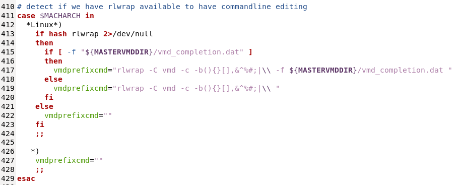

---
---

# VMD autocompletion

it really bothers me a lot without the autocompletion in modern console. How the * can we use the terminal, _as so called console in last century from you old geeks,_ (a jealous tone with full of respects for your hardworking and talents), without it?

**what is the autocompletion?**

it is a mechanism can shallowly read my minds to complete the full word when I "double TAB" on a few chars.

carrying on this idea, the most successful application, so far I know, is the "fuck" package, link: [https://github.com/nvbn/thefuck](https://github.com/nvbn/thefuck), given on a little clue, you can "fuck" them all, until to the end.

let us back to our topic, `VMD` is a acronym [Visual Molecular Dynamics](https://www.ks.uiuc.edu/Research/vmd/), I am struggled with it on this typical question in a very long time.

I know `VMD` is mostly on the basis of `Tcl` language, so I initially thought it was my computer's problem that made it lack of this function, which is also the reason I have spent some time on the customization of [tclsh](../System/Linux/tclsh.html), however, I was not lucky.

I decided to parse its source codes, I happen to find a file called "vmd_completion.dat" under its folder, I realized `VMD` does have this feature built, it must be something wrong in my settings, or even worse, compilation process.

After debugging in some time, I finally located the culprit,

See, the work of auto-completion is done by [rlwrap](https://github.com/hanslub42/rlwrap), which is missing in my computer!

knowing it, after `rlwrap` is installed, everything is perfectly solved.

Besides, I happen to find a discussion slightly related with it: [https://www.ks.uiuc.edu/Research/vmd/mailing_list/vmd-l/24558.html](https://www.ks.uiuc.edu/Research/vmd/mailing_list/vmd-l/24558.html)

However, honestly, I do have little complaining about it, this important feature should have been mentioned inside its document.

Nonetheless, I still want to express my full of gratitude and respects to VMD and its developers.

