---
---

# tkinter Button

Up to now, at least I know, I didn't see any advantages for **theme widget**s in `ttk` over general widgets. Instead, I think `tk.widget`s is way too better than `ttk.widget`s.

For example, you can directly see every its options showing in `tk.widget`, however, in `ttk.widget`, you have to use `w.style.configure()` as a workaround.

So, it will be clear that which widget you should choose when you are hesitating on your decision.

Now, let me go deep in `tk.Button`


link: [tkinter-button](https://anzeljg.github.io/rin2/book2/2405/docs/tkinter/button.html)


## text

if we simply generate a button;

codes download: [tk-button-text.py](file/tk-button/tk-button-1.py)


```python
import tkinter as tk

root = tk.Tk()

btn = tk.Button(root,text='Button')

btn.grid(row=0,column=0)
root.mainloop()
```

its button size will only depends on its `text` size, just make it slightly _contain_ its text.

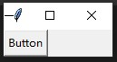


## textvariable

option `textvariable` is an instance of `StringVar()`, common thing between it and `text` is they can be both used to render texts. However, `textvariable` is more advanced, its contents can be dynamically changed.

Beside, when both `text` and `textvariable` are defined, `text` will be discarded.


### proof 1, when they are conflicts

codes download: [tk-button-textvariable](file/tk-button/tk-button-2-1.py)

```python
import tkinter as tk

root = tk.Tk()

txt_var = tk.StringVar()
txt_var.set('Knob')
btn = tk.Button(root,text='Button',textvariable=txt_var)

btn.grid(row=0,column=0)
root.mainloop()
```

**result**

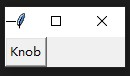

we can see, only "Knob" is shown.


### proof 2, delete contents of textvariable

be careful: in here, the word **delete** only means **purge** the contents, it cannot delete `StringVar()` object, also there is **no** `del` method for `StringVar()`.


codes download: [tk-button-remove-contexts](file/tk-button/tk-button-2-2.py)

```python
import tkinter as tk

root = tk.Tk()

txt_var = tk.StringVar()
txt_var.set('Knob')
btn = tk.Button(root,text='Button',textvariable=txt_var,
                command=lambda:txt_var.set('')
)

btn.grid(row=0,column=0)
root.mainloop()
```

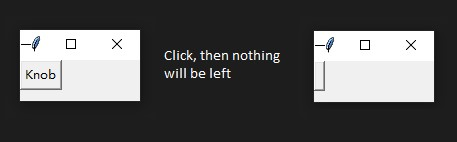


### proof 3, initialization with nothing or set to None

now, let us think more deep, how will it come when it's initialized with nothing or set to `None`?

```python
import tkinter as tk

root = tk.Tk()

txt_var = tk.StringVar()
#txt_var.set('Knob')        # comment out this len
btn = tk.Button(root,text='Button',textvariable=txt_var,
                command=lambda:txt_var.set(None)
)

# function is set to None

btn.grid(row=0,column=0)
root.mainloop()
```

the initial value of `StringVar()` is `''`, so you will get the same thing at the beginning as in **proof 2** when button is generated.


However, if you press it and set `textvariable` to `None`, which will be finally converted to its string.

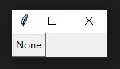


## width & height

we need to some references, link: [tk-dimensions](https://anzeljg.github.io/rin2/book2/2405/docs/tkinter/dimensions.html)

> If you set a dimension to an integer, it is assumed to be in pixels.
>
> You can specify units by setting a dimension to a string containing a number followed by:

| Suffix    |   Meaning                             |
|-----------|---------------------------------------|
|   c       |   Centimeters                         |
|   i       |   Inches                              |
|   m       |   Millimeters                         |
|   p       |   Printer's points (about 1/72″)      |


As we have already discussed, if there is no dimension specified, the size of `tk.Button` is only depended on its contents.


### dimension in integer

codes download: [tk-button-dimension](file/tk-button/tk-button-3.py)

```python
import tkinter as tk

root = tk.Tk()

btn = tk.Button(root,text='Button',
                width=50,
                height=10,
)

btn.grid(row=0,column=0)
root.mainloop()
```

compared with original button, we can see this button becomes pretty bigger.

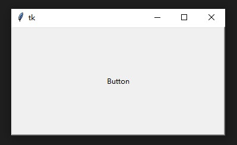


### others

you can specify `width='50c'`, which means dimension in 50 centimeters, for others, they are in the same formula but with different suffixes.


## padx & pady

`padx`: additional padding left and right for text.

`pady`: additional padding above and below for text.

note, this type of padding will **equally** pad on both corresponding sides for **a half** of given value.


codes download: [tk-button-pad](file/tk-button/tk-button-4.py)

```python
import tkinter as tk

root = tk.Tk()

btn = tk.Button(root,text='Button',
                padx=50,
                pady=10
)

btn.grid(row=0,column=0)
root.mainloop()
```

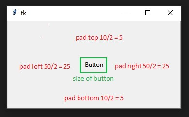


So, the size of this button is in the same size with button generated by `width=50, height=10`.


**Caution**: the padding of this option is only padded on the **exterior** of text container, so the "size" of its text container is not changed, as shown in "green rectangle", and I will denote this container as "text box".


## anchor

position of text alignment when "text box" is larger than the size of text.

**important**, by using this option, we can clear see the difference between `padx & pady` and `width & height`.

codes download: [tk-button-anchor](file/tk-button/tk-button-5.py)

```python
import tkinter as tk

root = tk.Tk()

btn_1 = tk.Button(root,
        text='Button 1',
        width=50,
        height=10,
        anchor='w',
        bg='cyan'
)

btn_2 = tk.Button(root,
        text='Button 2',
        padx=50,
        pady=50,
        anchor='w',
        bg='bisque'
)

btn_1.grid(row=0,column=0)
btn_2.grid(row=1,column=0)
root.mainloop()
```

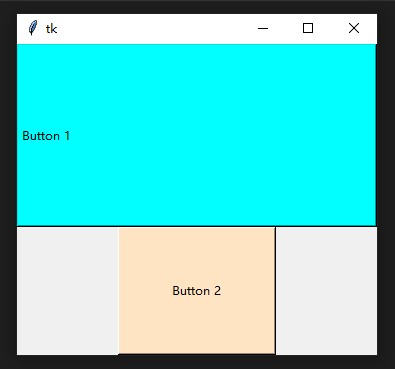


we can see,

1. anchor only works on when "text-box" is bigger than size of text
2. `padx & pady` only pads on outside of "text box"
3. the unit for `padx & pady` is <please refer below>
4. the unit for `width & height` is <please refer below>

Now, I totally figured out what is the unit for "3" & "4", please refer this question & answer: [stackoverflow-change-font-size-without-messing-with-tkinter-button-size](https://stackoverflow.com/questions/42840070/change-font-size-without-messing-with-tkinter-button-size)

Actually, the size of `tk.Button` is based on the size of character that it contains (meaningful & reasonable).

And for the workaround, wow, they are so brilliant, thanks for those talent peoples' contributing!


## justify

this works for multiple text lines.

codes download: [tk-button-justify](file/tk-button/tk-button-6.py)


```python
import tkinter as tk

root = tk.Tk()

btn = tk.Button(root,
        text='Button in line 1\nAnother text in line 2\nAdditional info in line 3',
        width=50,
        height=10,
        justify=tk.LEFT
)

btn.grid(row=0,column=0)
root.mainloop()
```

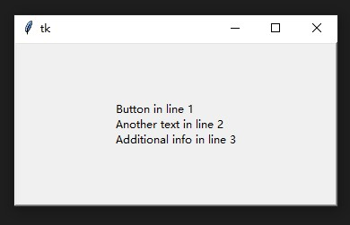

Also, you can use python string define its value, `justify='left'`.

Note, the keyword has to be in **small** cases, otherwise, the `Exception` will be raised if you use `justify=LEFT` or `justify=Left`, (I really don't understand why it has such restriction), the same things on `tk.RIGHT` & `tk.CENTER`.


## border and colors

codes download: [tk-button-border-colors](file/tk-button/tk-button-7.py)

```python
import tkinter as tk

root = tk.Tk()

btn_1 = tk.Button(root,
        text='Button 1',
        width=50,
        height=10,
        bg='cyan',
        bd='6',
)

btn_2 = tk.Button(root,
        text='Button 2',
        bg='bisque',
        fg='red'
)


btn_1.grid(row=0,column=0)
btn_2.grid(row=1,column=0)
root.mainloop()
```

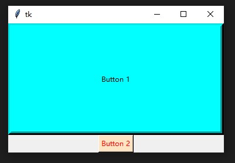


Just like its name, `bg == background`, `fg == foreground`, `bd == borderwidth`.

Note: for color, either its name or hex-code can be accepted.

link: [w3school-hex-color-code-picker](https://www.w3schools.com/colors/colors_picker.asp)

Also, link for: [color-names](https://htmlcolorcodes.com/color-names/)


## relief

codes download: [tk-button-relief](file/tk-button/tk-button-8.py)

```python
import tkinter as tk

root = tk.Tk()

btn_1 = tk.Button(root,text='FLAT',width=20,height=8,bg='salmon',
    bd=6,relief='flat'
)

btn_2 = tk.Button(root,text='RAISED',width=20,height=8,bg='hotpink',
    bd=6,relief='raised'
)

btn_3 = tk.Button(root,text='SUNKEN',width=20,height=8,bg='limegreen',
    bd=6,relief='sunken'
)

btn_4 = tk.Button(root,text='GROOVE',width=20,height=8,bg='gold',
    bd=6,relief='groove'
)

btn_5 = tk.Button(root,text='RIDGE',width=20,height=8,bg='plum',
    bd=6,relief='ridge'
)


btn_1.grid(row=0,column=0)
btn_2.grid(row=0,column=1)
btn_3.grid(row=0,column=2)
btn_4.grid(row=1,column=0)
btn_5.grid(row=1,column=1)

root.mainloop()
```

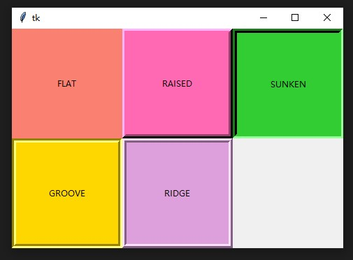


Note: option `overrelief` is the effect when mouse is on the button. Still, for their values, only small cases are accepted if you are using python strings.


## active and focus

they are self-explanatory

1. activebackground
2. activeforeground
3. cursor
4. state
5. disabledforeground
6. highlightbackground
7. highlightcolor
8. highlightthickness
9. takefocus


## image and bitmap

instead showing text, button can be rendered with pictures.

1. bitmap
2. image


## command

function to be called when button is pressed.


# Conclusion


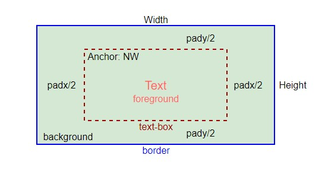


