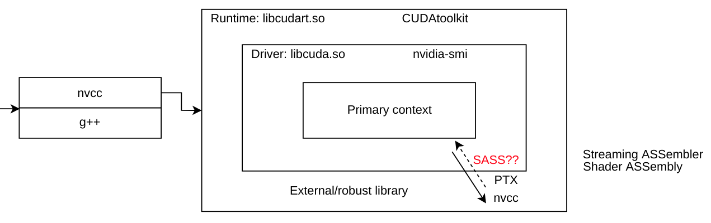

---
---

# Numba driver LinkerError

> numba.cuda.cudadrv.driver.LinkerError: [222] Call to cuLinkAddData results in UNKNOWN_CUDA_ERROR
>
> ptxas application ptx input, line u; fatal : Unsupported .version x.y; current version is m.n

when the time we are compiling `Python-Numba Cuda` codes, most likely the above error message will be printed out, complaining that drivers are not compatible with each other.

for the reason this error happens: here is a detail discussion on `Numba-GitHub` page: [https://github.com/numba/numba/issues/7006](https://github.com/numba/numba/issues/7006)

to summary, let me dig into a little bit deeper, below is an image showing the relations of `Cuda` Driver and toolkit,



as you can see, when executing, `PTX` (Parallel Thread Execution) will be used to make the link of `programming codes` and `machine bytes`, usually with a prerequisite, version of compiler should be **higher** than version of driver.

However, `Numba` does not have the ability to be aware of this type of `forward-compatibility`, as the excerpt from `@gmarkall` from Github page:

> Note that although Forward Compatibility is a feature of the CUDA Toolkit 11.x series, which allows you to use code compiled with a newer toolkit than the current driver version, Numba presently doesn't implement support for Forward Compatibility.

Thus, it is the user's duty to make the **consistent** with these two tools.

**first**, check driver's version:
```
execute: nvidia-smi

outputs:
+-----------------------------------------------------------------------------+
| NVIDIA-SMI 470.103.01   Driver Version: 470.103.01   CUDA Version: 11.4     |
|-------------------------------+----------------------+----------------------+
| GPU  Name        Persistence-M| Bus-Id        Disp.A | Volatile Uncorr. ECC |
| Fan  Temp  Perf  Pwr:Usage/Cap|         Memory-Usage | GPU-Util  Compute M. |
|                               |                      |               MIG M. |
|===============================+======================+======================|
|   0  NVIDIA GeForce ...  On   | 00000000:01:00.0 N/A |                  N/A |
| 40%   40C    P0    N/A /  N/A |    507MiB /  4043MiB |     N/A      Default |
<eclipse>
```


**second**, check `Numba` Runtime Driver's version:

```
execute: numba -s | less

search: Driver:

outputs:
<eclipse>
__CUDA Information__
CUDA Device Initialized                       : True
CUDA Driver Version                           : (11, 4)
CUDA Runtime Version                          : 11040
CUDA NVIDIA Bindings Available                : False
CUDA NVIDIA Bindings In Use                   : False
<eclipse>
```

make sure the value in `CUDA Driver Version` and `CUDA Runtime Vresion` to be consistent, which is `(11, 4)` and `11040`.

More detail releases will be found in: [https://docs.nvidia.com/cuda/cuda-toolkit-release-notes/index.html](https://docs.nvidia.com/cuda/cuda-toolkit-release-notes/index.html)

if not, downgrade/upgrade `CUDA Runtime Version` by (if you are using `Miniconda`): 

```
conda install conda-forge::cudatoolkit=11.4
```

if error happens like: "conda ProxyError: Conda cannot proceed due to an error in your proxy configuration"

solving it by:

```
execute: env | grep -i '_proxy'

unset every searched value

then try again
```


