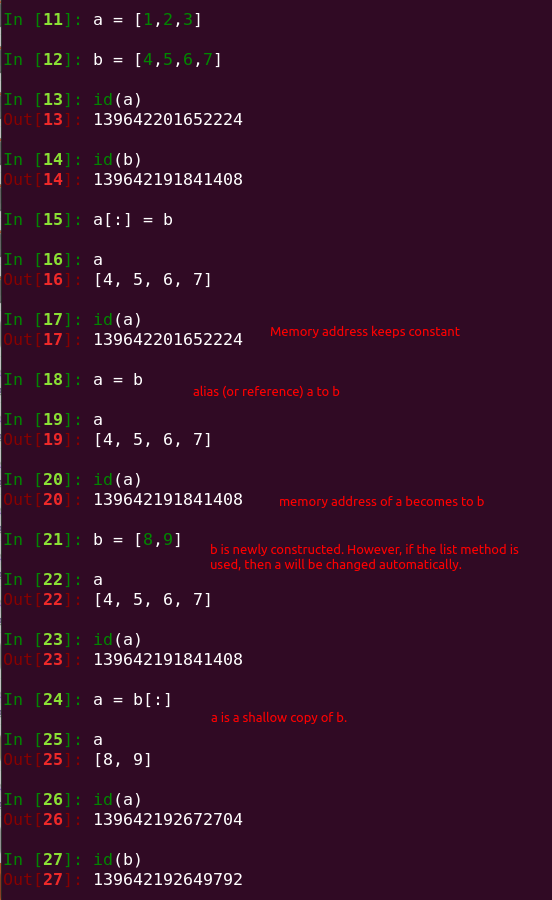

---
---

# python list[:] operation

I came across a question about the difference between `alist[:] = blist` and `alist = blist[:]`, and surprisingly found no one has mentioned the `id` difference of these two operations.

To know why I have this kind of curiosity: [python-site-module](https://github.com/python/cpython/blob/3.10/Lib/site.py#L143), you will find that:

```python
...
    sys.path[:] = L
    return known_paths
```

I know this function is used to filter out repeats inside `sys.path`, but why does it have this kind of assignment? How about `sys.path = L`, `sys.path = L[:]` and etc..?

Digging deeper, I then know the fundamental idea behind this operation, they want to keep constant of the ID memory address.




