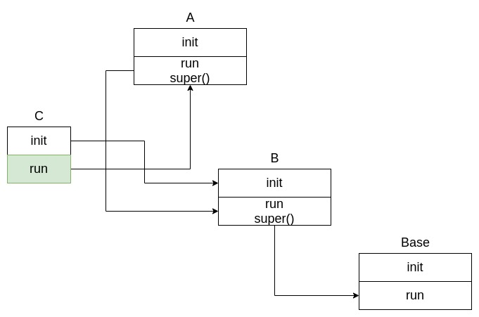

---
---

# Python super() in class inheritance

`super` is an implicit implementation for class inheritance.

be aware of that its "sequence" is calculated by / dependent on `Method Order Resolution`.


```python
class Base:
    def __init__(self,*args,**kwargs):
        print('inside Base.__init__')
        self.info = 'Base.__init__'

    def run(self):
        print('Base.run() is called')
        self.info = 'Base.run()'


class A(Base):
    def __init__(self,*args,**kwargs):
        print('inside A.__init__')
        self.info = 'A.__init__'

    def run(self):
        print('A.run() is called')
        print('inside A ',self.info)
        super().run()
        print('inside A ',self.info)
        self.info = 'A.run()'


class B(Base):
    def __init__(self,*args,**kwargs):
        print('inside B.__init__')
        self.info = 'B.__init__'

    def run(self):
        print('B.run() is called')
        print('inside B ',self.info)
        super().run()
        print('inside B ',self.info)
        self.info = 'B.run()'


class C(A,B):
    def __init__(self,*args,**kwargs):
        print('inside C.__init__')
        B.__init__(self,*args,**kwargs)


print(C.__mro__)

T = C()
T.run()


#  ( <class '__main__.C'>,
#       <class '__main__.A'>,
#           <class '__main__.B'>,
#               <class '__main__.Base'>,
#                   <class 'object'> )
#
#  inside C.__init__
#  inside B.__init__
#  A.run() is called
#  inside A  B.__init__
#  B.run() is called
#  inside B  B.__init__
#  Base.run() is called
#  inside B  Base.run()
#  inside A  B.run()
```




By the way, for `super`, which already implicitly binds with `self`, thus, its arguments can be directly taken into as inputs.

For example,

```python

class A:
    def __init__(self,*args,**kwargs):
        pass


class B(A):
    def __init__(self,*args,**kwargs):
        
        # initial by name
        A.__init__(self,*args,**kwargs)

        # by super(), self is omitted
        super().__init__(*args,**kwargs)
```

