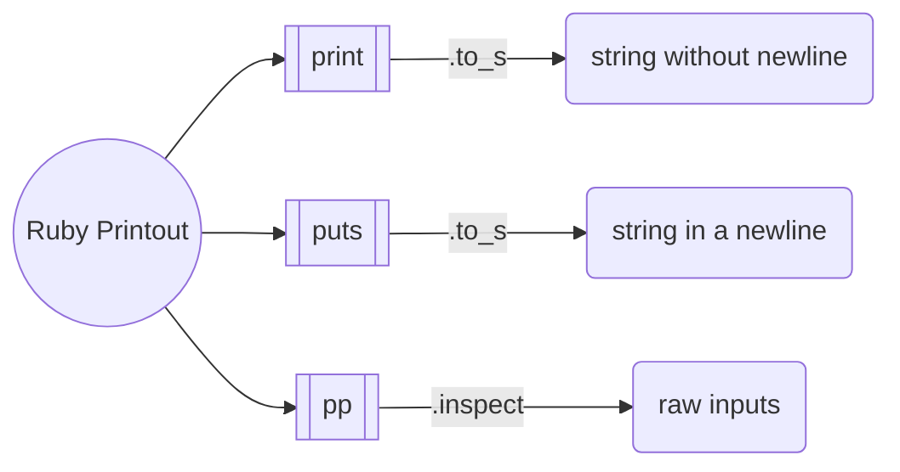

---
---

# Ruby Difference for p & puts & print

they are all used to printout info, but they are different.

`p` is using the `.inspect` method, however, `puts` is using `.to_s` method.


# Proof

**example codes:**

```ruby
class Foo
    def inspect
        "In Foo inspect"
    end

    def to_s
        "In Foo to_s"
    end
end

foo = Foo.new

p foo
puts foo
```

**outputs:**

```
In Foo inspect
In Foo to_s
```

**main difference**

`puts` always try to convert to string

`p` print raw inputs, more useful and powerful in `debugging`


# Summary





