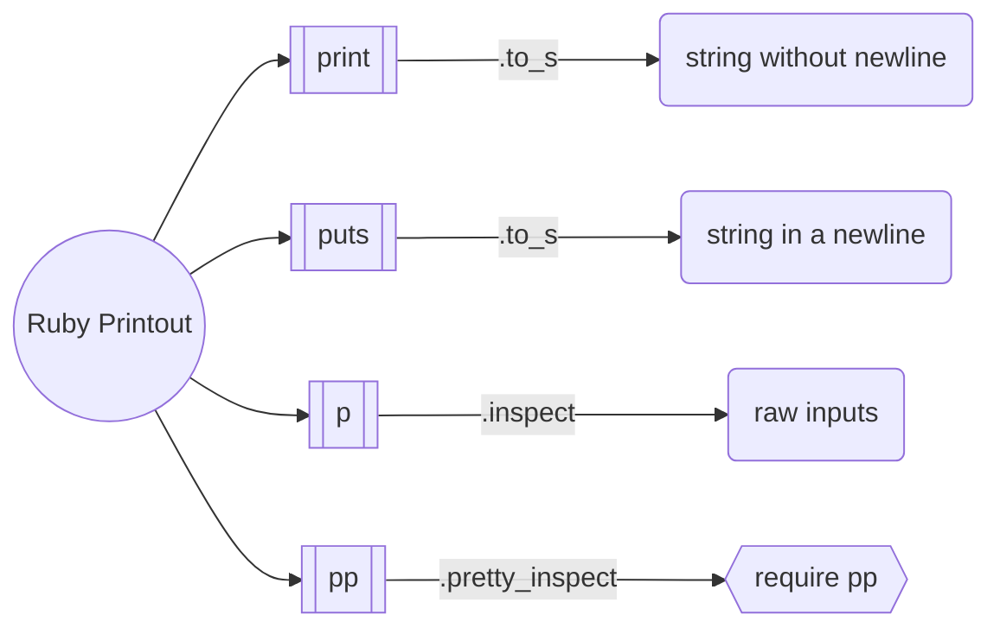

---
---

# Ruby Difference for p & puts & print

they are all used to printout info, but they are different.

`p` is using the `.inspect` method, however, `puts` is using `.to_s` method.


# Proof

**example codes:**

```ruby
class Foo
    def inspect
        "In Foo inspect"
    end

    def to_s
        "In Foo to_s"
    end
end

foo = Foo.new

p foo
puts foo
```

**outputs:**

```
In Foo inspect
In Foo to_s
```

**main difference**

`puts` always try to convert to string

`p` print raw inputs, more useful and powerful in `debugging`


# pretty-print

grateful to this answer on `stackoverflow`: [**@gioele**](https://stackoverflow.com/questions/9008847/what-is-difference-between-p-and-pp)

>`p` is used to inspect a variable as a debug aide. It works printing the output of the method `#inspect`. For example `p foo` will output the content of `foo.inspect`.
>
>Sometimes you need to debug complex variables or nested variables. In this case `p` will output a long line that is hard to understand. Instead, `pp` will put try to arrange the content of the variable so that it is easier to understand, for example indenting nested arrays or using one line for each instance variable of a complex object. `pp` does this calling the `#pretty_inspect` method (the `pp` library adds `#pretty_inspect` methods to many classes such as `String`, `Array` or `Struct`).
>
>To remember: p = print, pp = pretty print.


# Summary





