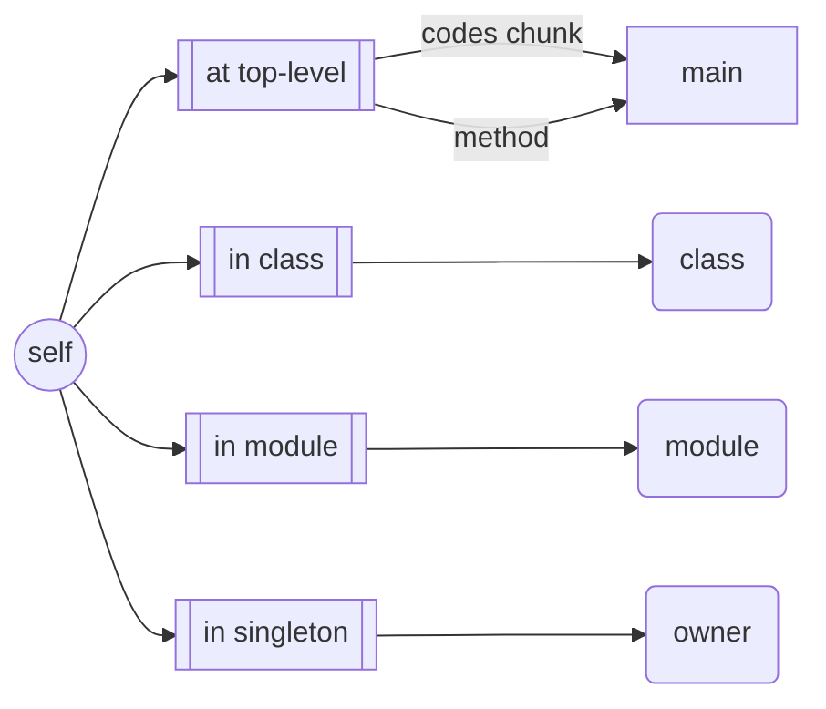

---
---

# Ruby self

it has one and only has one `self`, to point the current or default object accessible.

# at top level

`self` points to `main`

```ruby
p self          #==> main
```

```ruby
def m
    p self      #==> main
end
```


# inside class or module

`self` will be the class or module object

```ruby
class S
    p self          #==> S
    module M
        p self      #==> S::M
    end
end
``` 

```ruby
class S
    def m
        p self
    end
end
s = S.new
s.m         #==> #<S:0x1229181>     means the instance of S
```


# in singleton method

`self` inside singleton method means the object owns it.

```ruby
class S
    def S.m
        p self      #==> S      who owns method m
    end
end
```

# summary



