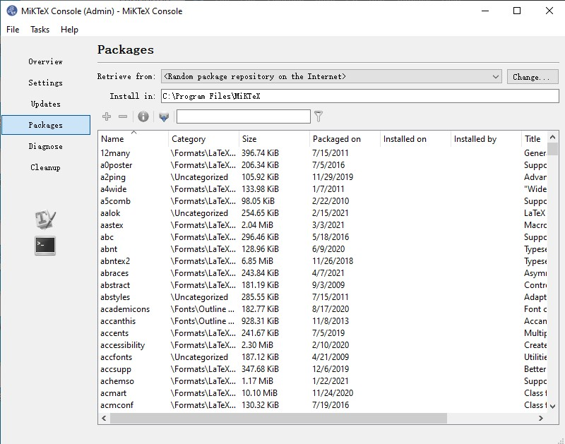
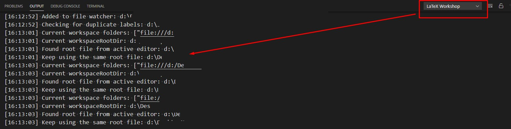

---
---

# Integrate Latex into VSCode


## Installation

The goal is we only want to get `LaTex` essential parts without any GUI functions. Thus `TeX Live` is not a good choose, which is way to big, currently is up to 7GB if `full` is chosen.

Recommend to choose `MikTeX`, link: [https://miktex.org/download](https://miktex.org/download)

After installation, by using its `console`, we can specifically download the distributions that we may need.




```note
Command `latexmk` or `pdflatex` needs to be manually installed by searching inside `console`. To run them, `perl` is needed.
```

Note: its `environment variable` and `PATH` have to be correctly defined!


## Setup Latex-workshop

1. Install extension Latex-workshop, its ID: `james-yu.latex-workshop`.

2. Configure LaTex recipes, by using variable `latex-workshop.latex.recipes` or `latex-workshop.latex.tools`. Link: [https://github.com/James-Yu/LaTeX-Workshop/wiki/Compile#latex-recipes](https://github.com/James-Yu/LaTeX-Workshop/wiki/Compile#latex-recipes)

3. Try a simple case, check its build info, to make sure everything works well.




## More info

I happen to find a small and useful package, its name is called `TexMaker`, which can be downloaded from: [https://www.xm1math.net/texmaker/download.html](https://www.xm1math.net/texmaker/download.html)

around **~65MB**, but very powerful and easy-to-use.


