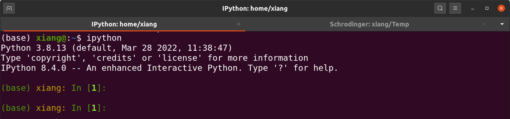
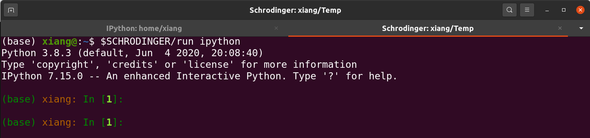

---
---

# custom interactive python (IPython) title and prompts (PS1)


> IPython is a command shell for interactive computing in multiple programming languages, originally developed for the Python programming language, that offers introspection, rich media, shell syntax, tab completion, and history. IPython provides the following features: Interactive shells.


Inspired by `@_WaylonWalker`, link: [https://waylonwalker.com/custom-ipython-prompt/](https://waylonwalker.com/custom-ipython-prompt/)


I know that the *prompts* is controlled by the [pygments.Tokens](https://pygments.org/docs/tokens/), specially defined in class `IPython.terminal.prompts.Prompts`, method `in_prompt_tokens` and `out_prompt_tokens`.


carefully cross-checking between those writings(refer to the links), I finally made a script to custom my `IPython` to the way that I like:






Here comes a question, why do I differentiate the titles with `IPython:` and `Schrodinger:`?

The reason is, I have installed many programs in my computer (you know that, for work or interests), in order to be maximumly compatible with various systems, many of those programs will come with a pre-compiled and stand-alone Python package, e.g. by modifying the environment variable `PYTHONHOME` (I will not go much detail in here). Thus, they may cause confuse to me, to know which `ipython` I am using, whether from my system or from my installed program. So, it is necessary to inform me where I am.


Below is my codes:

```python
from IPython.terminal.prompts import Prompts, Token

import os
import sys


CONDA = os.getenv('CONDA_DEFAULT_ENV','')

class MyPrompt(Prompts):
    def in_prompt_tokens(self):
        return [
            (Token.Prompt, self.vi_mode() ),
            (Token.Prompt, '('+CONDA+') '),
            (Token.Literal.String, os.path.basename(os.getcwd())+': '),
            (Token.Prompt, 'In ['),
            (Token.PromptNum, str(self.shell.execution_count)),
            (Token.Prompt, ']: '),
        ]


ip = get_ipython()
ip.prompts = MyPrompt(ip)

if 'schrodinger' in sys.prefix.lower():
    ip.prompts.shell.term_title_format = 'Schrodinger: {cwd}'
```


save it to a script and put into `~/.ipython/profile_default/startup`, then you are done, enjoy!


