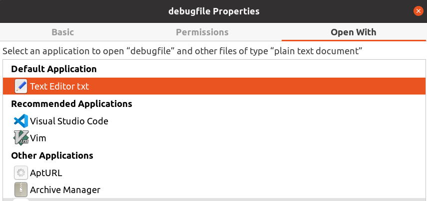

---
---

# Ubuntu Set Default Applications for File Association

## Via of GUI



## Via of "defaults.list" file

Specially for Ubuntu, they are located at:

```
/etc/gnome/defaults.list
/usr/share/applications/defaults.list
~/.local/share/applications/defaults.list

# the precedence is in low to high
```

