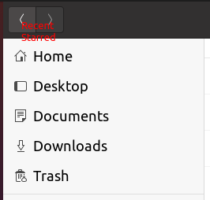
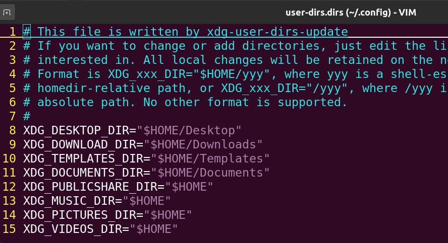

---
---

# Ubuntu remove Recent and Starred Folders in sidebar

it is annoying that there are `pinned` folders in sidebar, like:



we do not want our File Explorer to be polluted by those unnecessary folders, here is a way to remove `Starred` folder:

link: https://askubuntu.com/questions/1194319/can-the-starred-folder-in-the-left-pane-of-files-nautilus-be-removed


To remove `Recent` folder:

```
gsettings set org.gnome.desktop.privacy remember-recent-files false
```

Besides, for folder `Video` `Picture` and etc., remove them by editing file `~/.config/user-dirs.dirs`



