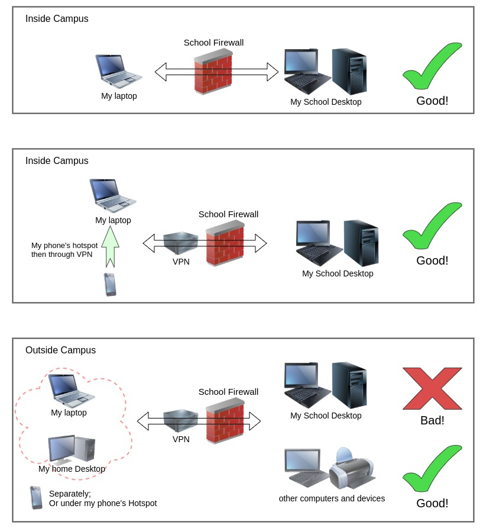

---
---

# Samba Weird Situation

the reason I wrote this post is I have gone through a lot of pains of Samba sharing. It has made me suffer a lot, in order to solve this **weird** problem, I read many many posts as far as I can googled, and learned lots of novel knowledge that probably will never be used for future.

Let me explain in detail;

before starting, please remember this Gold Rule;

> For security considerations, my school will not allow any outside campus devices connect inside network.
> 
> Therefore, any appliances not using school-network want to link devices inside has to via of certificated VPN client, Pulse Secure.

I have a plot to show this weird situation;

You can see;

everything works well inside school's internet, both on my laptop & my phone's hotspot.

however, once outside the campus, nothing works at all, neither my laptop or my home Desktop, or under my phone's hotspot.

_Note: I did not do any changes, just brought them to home_

some discussions:

1. by the good links inside campus, undoubtedly, the settings for Samba and firewall are all correct, and without any problems.
2. when outside campus, connecting with other computers and devices, Samba is good, we know its settings are still perfect fine, however, when linking to my school Desktop, it refuses to work at all.

One thing has to be noted that it is impossible that there are any hackers or super administrators purposely setting any policies exclusively ruling out my outside campus connecting to my school Desktop!

I, for surely, will never and ever know what it is going on of this Samba problem.

Or even convince other people that I have ever encountered this unbelievable situation, like I am a psycho or in day dreaming.

FUCK ME!

For the wasted puzzled, miserable and self-doubting days.

_I completely reinstalled Samba._

