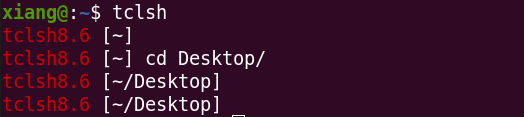
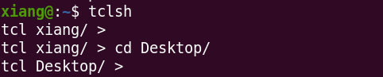
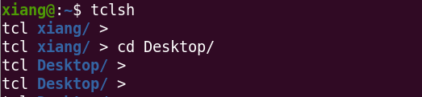
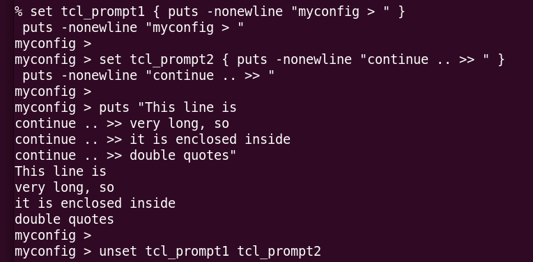

---
---

# tclsh auto-complete

suggest package is: `tclreadline`.

its `git` link: [https://github.com/flightaware/tclreadline](https://github.com/flightaware/tclreadline)

official link: [http://tclreadline.sourceforge.net/](http://tclreadline.sourceforge.net/)

to install it:

```
sudo apt install tcl-tclreadline
```

after installation is done, add activation to `.tclshrc`

```
if {$tcl_interactive} {
    package require tclreadline
    ::tclreadline::Loop
}
```

However, defining in this way the `prompt` cannot be customized, [see tcl-customize-prompt](#tcl-customize-prompt), which works like `colored-tcl-version [pwd]`,



Full `pwd` is intolerant, especially when you are in a deep hierarchical path, we only want it to show in `basename`,

```
if {$tcl_interactive} {
    package require tclreadline

    namespace eval tclreadline {
        proc prompt1 {} {
            set basename [lindex [split [pwd] /] end]
            return "tcl $basename/ > "
        }
    }

    ::tclreadline::Loop
}
```




Furthermore, we want it to be colored to differentiate,

```
if {$tcl_interactive} {
    package require tclreadline

    namespace eval tclreadline {
        proc prompt1 {} {
            set basename [lindex [split [pwd] /] end]
            return "tcl \033\[01;34m$basename/\033\[0m > "
        }
    }

    ::tclreadline::Loop
}
```



for ANSI escape code: [https://gist.github.com/fnky/458719343aabd01cfb17a3a4f7296797](https://gist.github.com/fnky/458719343aabd01cfb17a3a4f7296797)


## tcl library path

`auto_path`: [https://www.systutorials.com/docs/linux/man/n-auto_path/](https://www.systutorials.com/docs/linux/man/n-auto_path/)

to show its path, inside `tcl` shell,

```

puts $auto_path
# puts $::auto_path

# OR

join $::auto_path \n
```

[customize-auto_path](https://wiki.tcl-lang.org/page/auto_path)


## tcl package require

link: [https://wiki.tcl-lang.org/page/package+require](https://wiki.tcl-lang.org/page/package+require)


## tcl customize prompt

link: `tclsh`[https://www.tcl.tk/man/tcl8.4/UserCmd/tclsh.html](https://www.tcl.tk/man/tcl8.4/UserCmd/tclsh.html)

> When tclsh is invoked interactively it normally prompts for each command with ``% ''. You can change the prompt by setting the variables tcl_prompt1 and tcl_prompt2. If variable tcl_prompt1 exists then it must consist of a Tcl script to output a prompt; instead of outputting a prompt tclsh will evaluate the script in tcl_prompt1. The variable tcl_prompt2 is used in a similar way when a newline is typed but the current command isn't yet complete; if tcl_prompt2 isn't set then no prompt is output for incomplete commands.


what is the difference between `tcl_prompt1` and `tcl_prompt2`?




As we can see, `tcl_prompt1` set prompt that we want, `tcl_prompt2` acts like a notice for the incomplete typing.


## others

good to know another file archive type `zstd`

its link: [https://github.com/facebook/zstd](https://github.com/facebook/zstd)

```
sudo apt install zstd
unzstd file.zstd
```


