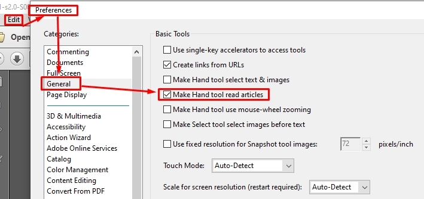

---
---

# hide hand tool inside arrow

When we are reading a PDF file, sometimes we will find an annoying part, which is there is an "arrow" inside the hand-tool, whether showing "Down" or "Up" direction.


as the above image shows, whenever you suddenly click the mouse, you will find the page is "rotating" between your "current" page and "previous" page, which is intolerable.

hand tool should always be a tool to view pages, why does it have those "seemingly considerable functions"? Fuck!

to turn it off;

```
uncheck "Make Hand tool read articles"
```




